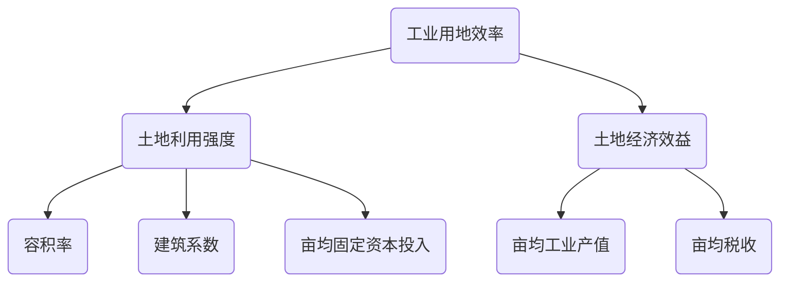
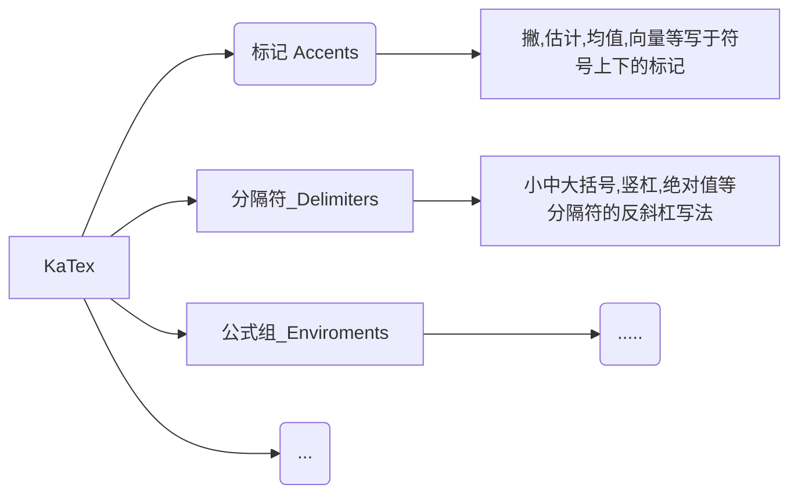

```mermaid

graph TB
A(工业用地效率)-->B1(土地利用强度)
A-->B2(土地经济效益)
B1-->C1(容积率)
B1-->C2(建筑系数)
B1-->C3(亩均固定资本投入)
B2-->D1(亩均工业产值)
B2-->D2(亩均税收)
```

```mermaid
graph LR  
KaTex--> A(标记 Accents)
A-->撇,估计,均值,向量等写于符号上下的标记
KaTex--> 分隔符_Delimiters
分隔符_Delimiters-->小中大括号,竖杠,绝对值等分隔符的反斜杠写法
KaTex--> 公式组_Enviroments
公式组_Enviroments-->B(.....)
KaTex-->C(...)
```